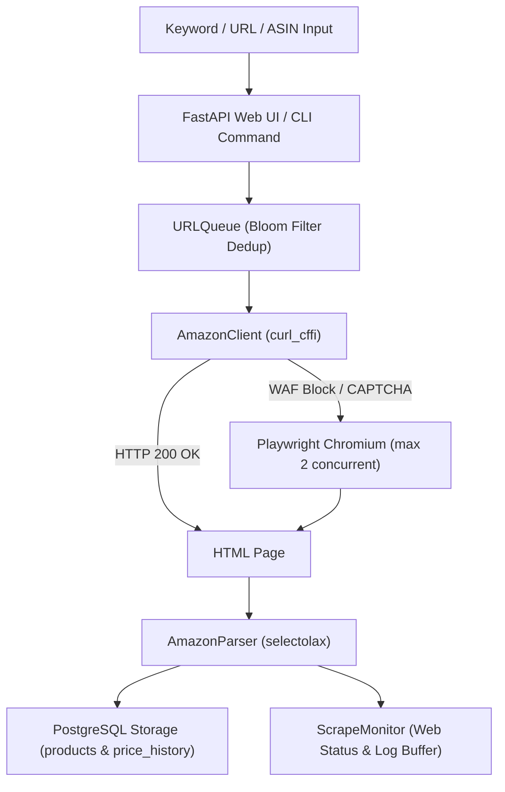

# Amazon Product Scraper with Modern Web UI Dashboard

A high-performance, asynchronous Amazon product scraping system designed to scale to **200K+ products daily**. Uses a hybrid HTTP-first approach (using `curl_cffi` for TLS fingerprinting) with a robust **Playwright browser automation fallback** to bypass strict Akamai WAF blocks, enqueues crawls via a smart Bloom Filter, and stores data in a **PostgreSQL** database.

Features a beautiful, responsive, dark-mode glassmorphic Web UI Dashboard to control scraping and browse records easily.

---

## Key Features

- **Sleek Web UI Dashboard**: A graphic control panel to trigger scrapes, track real-time progress percentages, read live monospace logs, view KPIs (product count, average price, brand count), and browse PostgreSQL records with search, filter, and pagination.
- **Price Falls & Alerts Tab**: Automatically tracks historical price trends. Alerts you in a dedicated **Price Alerts** tab when a product's price falls by a configurable threshold (e.g. 10%, 20%, 30%, 40%, 50% drops) compared to its initial recorded price.
- **Automatic Background Drip-Scraping**: Silently refreshes stored product prices in the background at a slow, rate-limit-safe pace (1 product every 15 seconds) on startup, keeping the database up-to-date continuously without triggering WAF blocks or requiring proxies.
- **Scrape Latest Prices (CTA)**: A manual trigger button inside the alerts view that spawns a high-speed background crawler (using up to 50 concurrent requests) to immediately refresh the prices of all stored products. (Best used when a proxy list is configured in `proxies.txt`).
- **Clear Price Alerts (CTA)**: A dedicated button in the alerts view that allows you to clear all active alerts and reset baseline prices in one go, setting the current price as the new baseline.
- **Multi-Keyword Scraping**: Supports inputting multiple keywords separated by commas (e.g. `soap, shampoo, lotion`) directly in the Web UI dashboard or using CLI arguments, executing search-scraping sequentially in a single run.
- **Size/Quantity Extraction**: Automatically parses specifications (volume: `ml`/`L`, weight: `g`/`kg`, count: `Pack of 4`) from product titles and displays them inside a dedicated **Size/Qty** badge column in the database browser.
- **Automatic Database Migrations**: Automatically alters table schemas on initialization and retroactively backfills specifications for all pre-existing database products.
- **TLS Fingerprint Impersonation**: Uses `curl_cffi` to match Chrome/Firefox TLS fingerprints, evading WAF and bot detection on initial fetch.
- **Playwright Fallback Bypass**: Automatically triggers a headless Playwright Chromium instance when WAF or CAPTCHA blocks are detected (guarded by a concurrency semaphore to prevent CPU/memory overload).
- **Keyword-Based Search Crawling**: Automatically crawls Amazon search listings, extracts unique ASINs, and adds them to the detail scraping queue.
- **Smart Queue Deduplication**: Incorporates a fast, low-memory Bloom Filter using `mmh3` and `bitarray` to prevent duplicate crawls, preserving state save/resume features.
- **Session-Sticky Proxy Manager**: Rotates a pool of residential proxies with session lock retention.
- **PostgreSQL Database Storage**: Supports daily snapshots and historical price tracking (defaulting to PostgreSQL, with SQLite supported as a fallback).
- **Graceful Shutdown**: Traps SIGINT/SIGTERM to save queue state to disk before exiting.

---

## Directory Structure

```text
├── app.py                # FastAPI web server backend
├── main.py               # Scraper orchestrator and CLI entrypoint
├── config.yaml           # Global configurations
├── requirements.txt      # Python dependencies
├── verify.py             # Integration verification test suite
├── src/
│   ├── __init__.py
│   ├── client.py         # Impersonation & Playwright HTTP client
│   ├── config.py         # Config overrides and loader
│   ├── models.py         # Dataclasses (Product, ScrapeResult)
│   ├── monitor.py        # Scraping statistics monitor
│   ├── parser.py         # selectolax CSS product & search parsers
│   ├── proxy.py          # Session-sticky proxy manager
│   ├── queue.py          # URL Queue & Bloom Filter
│   └── storage.py        # SQLite / PostgreSQL storage engine
└── static/
    ├── index.html        # Glassmorphic HTML5 dashboard
    ├── styles.css        # Premium custom CSS styling
    └── app.js            # Frontend JavaScript controller
```

---

## System Architecture



---

## Installation & Setup

1. **Clone the repository** and navigate to the project directory:
   ```bash
   cd amazon-scraper-web-ui
   ```

2. **Create and activate a virtual environment**:
   ```bash
   python -m venv venv
   source venv/bin/activate
   ```

3. **Install the required dependencies**:
   ```bash
   pip install -r requirements.txt
   playwright install chromium
   ```

4. **Database Configuration**:
   Ensure PostgreSQL is running locally on port `5432` with a database named `amazon_scraper` (or edit `config.yaml` to configure your connection string).
   ```yaml
   storage:
     backend: postgresql
     pg_dsn: "postgresql://localhost:5432/amazon_scraper"
   ```

---

## How to Run

### 1. Launch the Web UI Dashboard
Start the local FastAPI web application:
```bash
python -m uvicorn app:app --port 8000
```
Open your browser and navigate to **`http://localhost:8000`** to access the dashboard control panel, real-time log terminal, database stats widgets, and paginated product browser.

### 2. Launch via CLI
The scraper can also be run directly from the terminal:
```bash
# Keyword Search Scrape
python main.py scrape --keywords "mechanical keyboard" --max-pages 1 --marketplace in

# File-based URL Scrape
python main.py scrape --input urls.txt

# Resume Interrupted Scrape
python main.py resume

# View Local DB Stats
python main.py stats
```

---

## Development Verification
You can run the integration test suite to verify config, parsers, SQLite/PostgreSQL storage, URLQueue, and proxies:
```bash
python verify.py
```
